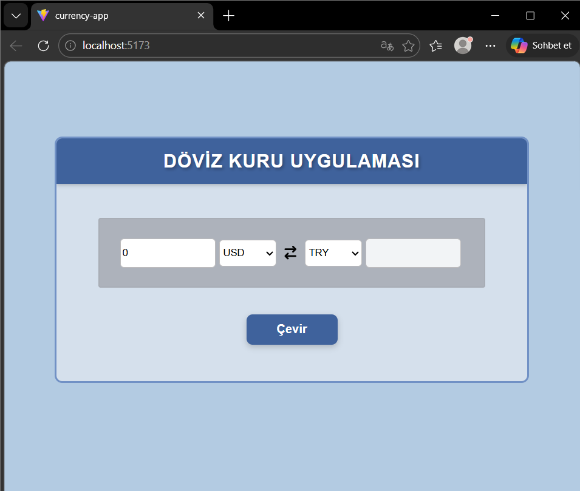
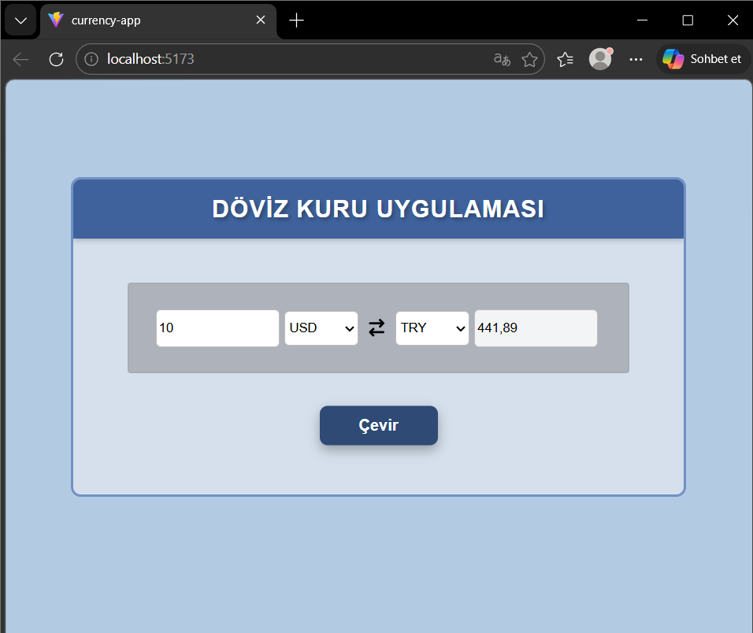

# Currency App

Currency App, seçilen para birimleri arasında hızlı ve pratik şekilde dönüşüm yapmayı sağlayan basit bir döviz çevirici uygulamasıdır. Kullanıcı tutar bilgisini girdikten sonra kaynak ve hedef para birimini seçer; uygulama da güncel kur verisini API üzerinden çekerek sonucu ekranda gösterir.

## Proje Hakkında

Bu proje, React ile geliştirilen temel bir arayüz üzerinde API kullanımı, state yönetimi ve kullanıcı etkileşimlerini pratiğe dökmek amacıyla hazırlanmıştır. Uygulama sade bir yapıya sahiptir ve temel kullanım senaryosuna odaklanır: bir para birimini başka bir para birimine çevirmek.

## Ekran Görüntüleri

### Ana Ekran

Uygulamanın başlangıç görünümü:



### Örnek Dönüşüm

Seçilen tutarın bir para biriminden diğerine çevrildiği örnek görünüm:




## Kullanılan Teknolojiler

- React: Arayüz bileşenlerini oluşturmak için
- Vite: Hızlı geliştirme ortamı ve proje yapısı için
- Axios: API isteklerini gerçekleştirmek için
- CSS: Uygulama stilini düzenlemek için
- FreeCurrencyAPI: Güncel kur verisini almak için

## API Bilgisi

Uygulama döviz kuru verilerini FreeCurrencyAPI servisi üzerinden almaktadır.

- API Servisi: FreeCurrencyAPI
- Endpoint: `https://api.freecurrencyapi.com/v1/latest`
- Kullanım amacı: Seçilen kaynak para birimine göre hedef para biriminin güncel değerini almak

API anahtarı güvenlik amacıyla doğrudan kaynak kod içine yazılmamış, `.env` dosyası üzerinden kullanılacak şekilde yapılandırılmıştır.

## Kurulum ve Çalıştırma

Projeyi yerel ortamda çalıştırmak için aşağıdaki adımları uygulayabilirsiniz:

```bash
npm install
npm run dev
```

Uygulamayı çalıştırmadan önce proje kök dizininde bir `.env` dosyası oluşturup aşağıdaki değişkenleri eklemelisiniz:

```env
VITE_CURRENCY_API_URL=https://api.freecurrencyapi.com/v1/latest
VITE_CURRENCY_API_KEY=buraya_kendi_api_anahtarinizi_yazin
```

Ardından tarayıcıda Vite tarafından verilen yerel adres üzerinden uygulamayı görüntüleyebilirsiniz.

## Geliştirme Notu

Bu proje, özellikle React'te state kullanımı, form elemanlarıyla çalışma, API'den veri çekme ve kullanıcı etkileşimlerine göre arayüz güncelleme konularında pratik yapmak için uygun bir örnektir.
